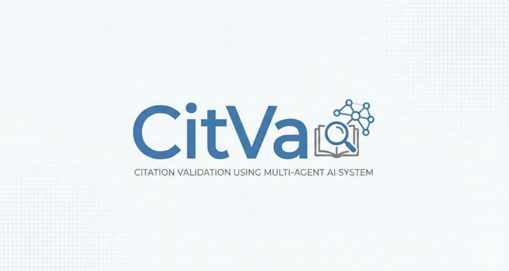
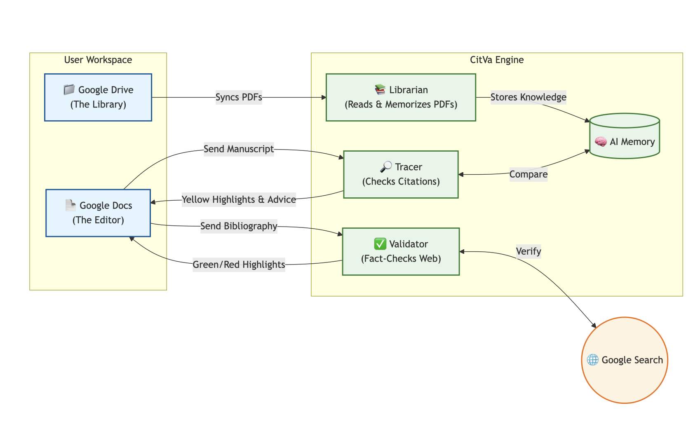

# 🛑 Disclaimer Statement
This repository serves as a submission artifact for the Google Cloud & Kaggle Agentic AI Intensive.

**Non-Production Status**: This code is experimental. It has not undergone security auditing or performance optimization.

**Third-Party Rights**: This software includes automated agents capable of retrieving and processing digital documents. It is the end-user's responsibility to respect Copyright policies. This tool should not be used to bypass paywalls or download content without authorization.

**Google Services**: This project utilizes Google Vertex AI, Ngrok and Google Drive APIs. Users are responsible for their own API costs and quota management.

**No Liability**: The author(s) of this repository are not liable for any damages, IP bans, or legal consequences arising from the use or misuse of this software.

*By cloning, forking, or running this repository, you acknowledge that you have read this disclaimer and agree to be bound by its terms.*

# 📝 Introduction
Hi! Welcome to Citation Validation using Multi-agentic system (CitVa). This software aims to help researchers on improving their literature search experience with extra grounding and reduce manual reference fact-checking. Please read the instructions below carefully to ensure a flawless experience. 

### 🛠️ Configurations & Setup

There are two scripts in this project:

1. citva.py (Python) - The main Agent and web-building blocks
- **DO NOT run the Python code in Kaggle Notebook as the kernel will crash!!!**

2. google_doc_appscript.js (JavaScript) - UI/UX for Google Doc

#### Note **(All of the usage below are free for development, not production)**

- Create a project in Google cloud to get the project ID and Service Account JSON 
- Activate the Google Drive API in IAM management for the project 
- Create a ngrok account for web deployment and get the authorisation token

Configuration in Google Doc:
- **RUN the Python code to generate the ngrok link first**
- Create a Google Drive folder and share it to the client email address from the Service Acount 
- Go to Google Doc > Extension > App Scripts > google-doc-appscript > Code.gs 
- Copy the link generated from Ngrok on the first line in the JavaScript

                                       const ENDPOINT_URL = "NGROK_LINK"

- Go back to the main doc page and you will see "CitVa- Research Validator" on the menu 

# 🚂 How to use CitVa?

*Press the "Set/Reset Drive Folder" to ensure there is no Google Driver link. (For first time use only)*

*Try this software on a template research paper/assignment.*
*All agents are fed with log tracing for observability. Please read the "agent_trace.jsonl" on the same directory*

## 1️⃣ Bulk Validation References
1. Go to your reference list and highlight the whole reference list.
2. Click "2. ✅ Bulk Validate References (Validator)".
3. It will take less than a minute to process {Vary by the number of references}
4. Generate a report highlighting how many references are verified of failed
5. Each reference on the list  will be highlighted in GREEN(VERIFIED)/ORGANGE(SUSPECTED)/RED(UNVERIFIED) font for user visualisation 

## Optional: Deep Validate Selection
1. Highlight the particular reference (Single Entry) that is highlighted in ORANGE/RED
2. Click "↳ 🔬 Deep Validate Selection (Single Item)"
3. It will take less than 30 seconds to process
4. Generate a full report of the verification

## 2️⃣ Librarian & GateKeeper (*Recommended to try for a small amount of PDF for quicker testing*)
1. Upload all PDFs in your reference list to the linked Google Drive Folder
2. Click "1. 📂 Sync & Audit Library (Librarian)"
3. It will take some times to read, validate, and embed {Vary by the number of PDF}
4. Generate a full report of which references are valid, invalid, and missed 

## 3️⃣ Tracer 
1. Click "3. 🔎 Run Tracer Agent (Tracer)" directly WITHOUT highlighting anything
2. It will take some times to run, read, and retrieve
3. Generate a list of matching sentences with the references and provide suggestions on the right menu panel

## 4️⃣ Clear Highlight
1. Click "Clear Highlights"
2. Confirm that you want to remove all colours on the doc
3. Simply remove all colours

# 🧱 The Build 

This project aims to be lightweight and Google-native:

- The Brain (LLM): Gemini-2.5-Flash (Vertexai).
- The Hands (Tools): Google Workplace (Doc), Google Search.
- Orchestration: Three agentic AI are involved: (i) Validator; (ii) Librarian; (iii) Tracer.
- AppScripts for visualisation in Google Doc.

Agent 1. Validator
- Validate the reference(s) in single/list entry ---- [✅]
- Large reference list is processed in batches ---- [✅]
- The references will be labelled in Green (Pass), Orange (Suspected), Red (Error) ---- [✅]
- A deep search in single entry can be used in red-labelled references to provide in-depth report ---- [✅]
- Ensure there is no repetitive citations in the list ---- [✅]

Agent 2. Librarian 
- Read the article PDF in Google Drive ---- [✅]
- Extract title and DOI from the reference list ---- [✅]
- Read, secure and embed the PDF in archive/main chomaDB while preventing prompt injection and filter invalid PDFs---- [✅]
- Use of simple sub-agent as a gatekeeper to further validate and align the reference list---- [✅]

Agent 3. Tracer
- Retrieve vectors from chomaDB ---- [✅]
- Match citations and plagiarisms from the vectors and manuscripts ---- [✅]
- *"cosine-similarity"* to quantify the matching scores ---- [✅]
- Advanced alignment with the similarity score to ensure good quality of results ---- [✅]
